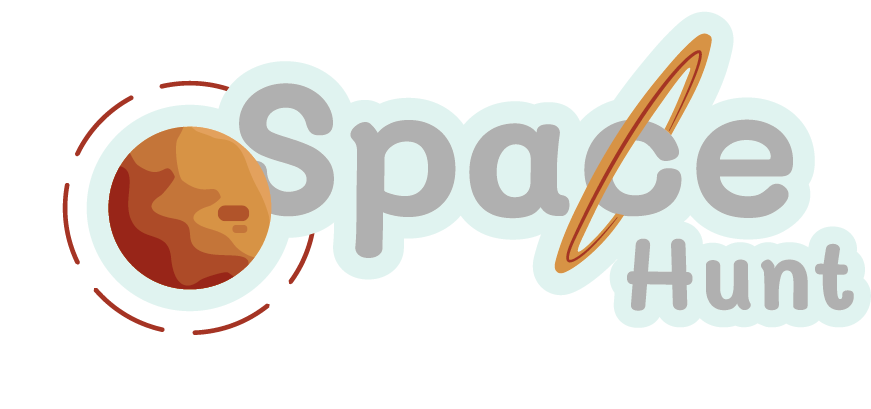

## Taller 2 Diseñando Con Algoritmos
Taller 2 para curso Diseñando con Algoritmos de Diseño de Medios Interactivos - Universidad ICESI
Behance: https://www.behance.net/gallery/72793923/Taller-2-Disenando-con-Algoritmos

Descripción general de clases y métodos utilizados en el código

- #### Main
  Clase principal, el programa se ejecuta aquí. Uso de la librería _processing.core.PApplet_.
  * **Métodos**
    * **settings(): void**
    * **setup(): void**
    * **draw: void**
    * **keyPressed(): void**
    * **mousePressed(): void**
- #### Logica
  Clase encargada de los menús principales y su interacción. Llama y ejecuta la clase _Mundo_ y otras variables en dichos menús.
  * **Métodos**
    * **pintar(): void** Pinta los menús según el valor de la variable _pantalla_.
    * **interaccionMenu(): void** Zonas sensibles de la pantalla principal del juego.
    * **iterInstru(): void** Zonas sensibles de las instrucciones del juego.
    * **perdiste(): void** Zonas sensibles y resultados de la pantalla _perdiste_.
    * **ganaste(): void** Zonas sensibles y resultados de la pantalla _ganaste_.
    * **clic(): void** Cambiar de pantalla según la zona donde se de clic.
    * **tecla(): void** Reaccionar al teclado según las condiciones del método.
- #### Mundo
  Clase/Hilo de java que ejecuta los procesos durante la pantalla de juego.
   * **Métodos**
      * **pintar(): void** Pinta la interfaz del juego, los puntajes obtenidos en tiempo real, el tiempo de juego restante, los personajes y los recogibles.
      * **run(): void** Método necesario del hilo. Se ejecutan todos los procesos de añadir enemigos y recogibles, así como su eliminación.
      * **terminarJuego(): boolean** Devuelve _true_ si el tiempo de juego se ha acabado o el jugador ha sido cazado, _false_ en caso contrario.
      * **pararMus(): void** Detiene la música del juego si se está ejecutando.
      * **tecla(): void** Ejecuta acciones y aplica efectos según la tecla presionada.
- #### Recogible
  Clase padre encargada de los parámetros base de las clases hijas. Abstracta.
  * **Métodos**
    * **pintar(): void** Método abstracto que pinta las imágenes y procesos de las hijas.
    * **getPos(): PVector** Devuelve la variable pos (posición) de la clase.
- #### Estrella
  Clase hija. Extiende de Recogible. Los personajes pueden validar este elemento.
  * **Métodos**
    * **pintar(): void** Pinta la imagen de la estrella y su movimiento circular básico.
- #### Agujero
  Clase hija. Extiende de Recogible. Los personajes pueden validar este elemento.
  * **Métodos**
     * **pintar(): void** Pinta la imagen del agujero y su movimiento circular básico.
- #### Cometa
  Clase hija. Extiende de Recogible e implementa la interfaz Runnable. Los personajes pueden validar este elemento.
  * **Métodos**
    * **run(): void** Ejecuta el movimiento del cometa y sus variaciones.
    * **pintar(): void** Añade la imagen y la estela o historia del cometa.
    * **actualizar(): void** Le añade movimiento a la imagen y determina un tamaño para la estela.
    * **perseguir(PVector): void** Recibe un objetivo o punto de llegada del cometa. Añade fuerzas, velocidades y limita su movimiento.
    * **borrar(): boolean** Devuelve _true_ si el cometa se ha salido de la zona de juego y _false_ en caso contrario.
    * **getH(): Thread** Devuelve la variable hilo encargada de ejecutarse en la clase _Mundo_.
- #### Personaje
  Clase padre encargada de los parámetros base de las clases hijas. Extiende de Thread y es abstracta.
  * **Métodos**
    * **pintar(): void** Método abstracto que pinta las imágenes correspondientes al objeto.
    * **run(): void** Ejecuta los procesos que se realicen.
    * **actualizar(): void** Cambia la velocidad y la posición del objeto.
    * **perseguir(PVector): void** Recibe un vector que representa la posición deseada del objeto, genera una fuerza que cambiará la velocidad dependiendo de la posición actual respecto a la deseada.
 - #### Jugador
  Clase hija de Personaje, representa el objeto que el jugador controla.
  * **Métodos**
    * **run(): void** Ejecuta los procesos y métodos a realizar.
    * **pintar(): void** Pinta la nave y la estela.
    * **actualizar(): void** Cambia la velocidad y posición, y actualiza la estela dependiendo de la nueva posición del usuario.
    * **perseguir(PVector): void** Genera la fuerza del jugador hacia la posición del mouse, y detiene el movimiento si ya se llegó hasta él.
    * **validarObj(Recogible): boolean** Recoge los diferentes objetos y modifica los contadores que los representan.
    * **usarCometa(): void** Resta las estrellas necesarias y cambia a _true_ un booleano que representa el buff de velocidad.
    * **usarAgujeto(): boolean** Resta las estrellas necesarias y retorna _true_ cuando se utiliza.
    * **efectoCometa(): void** Dependiendo de los booleanos _cometaMas y cometaMenos_, aumentando o disminuyendo la velocidad del jugador.
    * **getPos(): PVector** Retorna el vector pos, que representa la posición del jugador.
 - #### Ovni
  Clase hija de Personaje, representa los enemigos del _Jugador_ controlado por el usuario.
  * **Métodos**
    * **run(): void** Ejecuta los procesos y métodos a realizar, dependiendo de su número de estrellas respecto a las del jugador.
    * **pintar(): void** Pinta el ovni.
    * **buscarObj(): void** Busca el recogible más cercano y se mueve hacia el, realiza el efecto del recogible, o suma estrellas.
    * **huir(): void** Se mueve en dirección contraria a la del jugador a una velocidad más alta de lo normal, valida si el jugador entra en contacto con el ovni, en caso de que si, elimina el ovni y suma estrellas al jugador.
    * **perseguirJugador(): void** Se mueve hacia el jugador, y si entra en contacto con este, gana 2 estrellas y le quita 5 al jugador.
    * **mover(): void** Evita que el ovni salga de la pantalla siempre y cuando no esté huyendo y ya haya entrado al menos una vez a la pantalla.
