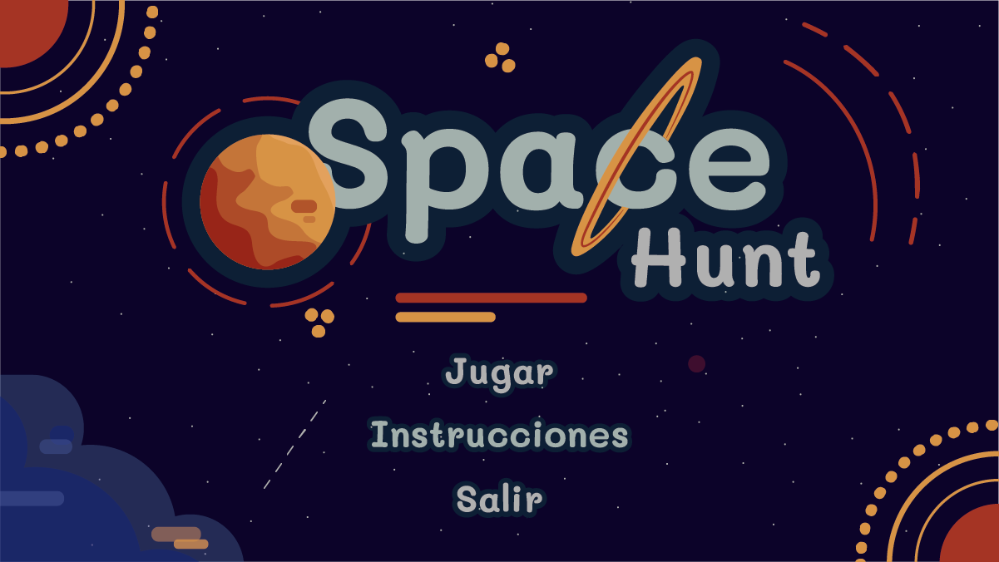

# Space Hunt

## Taller 2 Diseñando Con Algoritmos
Taller 2 para curso Diseñando con Algoritmos de Diseño de Medios Interactivos - Universidad ICESI

Descripción general de clases y métodos utilizados en el código

- #### Main
  Clase principal, el programa se ejecuta aquí. Uso de la librería _processing.core.PApplet_.
  * **Métodos**
    * **settings(): void**
    * **setup(): void**
    * **draw: void**
    * **keyPressed(): void**
    * **mousePressed(): void**
- #### Logica
  Clase encargada de los menús principales y su interacción. Llama y ejecuta las demás clases en dichos menús.
  * **Métodos**
    * **pintar(): void** Pinta los menús según el valor de la variable _pantalla_.
    * **interaccionMenu(): void** Zonas sensibles de la pantalla principal del juego.
    * **iterInstru(): void** Zonas sensibles de las instrucciones del juego.
    * **perdiste(): void** Zonas sensibles y resultados de la pantalla _perdiste_.
    * **ganaste(): void** Zonas sensibles y resultados de la pantalla _ganaste_.
    * **click(): void** Cambiar de pantalla según la zona donde se de clic.
    * **tecla(): void** Reaccionar al teclado según las condiciones del método.
- #### Mundo
Clase/Hilo de java que ejecuta los procesos durante la pantalla de juego.
   * **Métodos**
      * **pintar(): void** Pinta la interfaz del juego, los puntajes obtenidos en tiempo real, el tiempo de juego restante, los personajes y los recogibles.
      * **run(): void** Método necesario del hilo. Se ejecutan todos los procesos de añadir enemigos y recogibles, así como su eliminación.
      * **terminarJuego(): boolean** Devuelve _true_ si el tiempo de juego se ha acabado o el jugador ha sido cazado, _false_ en caso contrario.
      * **pararMus(): void** Detiene la música del juego si se está ejecutando.
      * **tecla(): void** Ejecuta acciones y aplica efectos según la tecla presionada.
      
